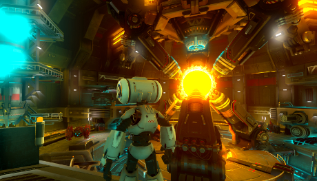
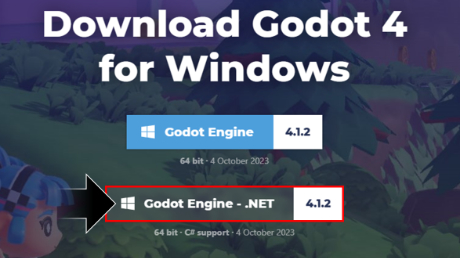
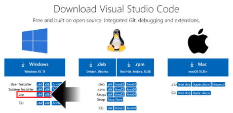
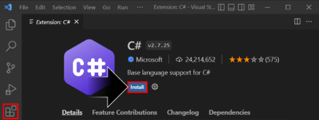
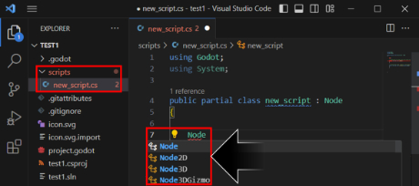

# [atet](https://github.com/atet) / [**_godot_**](https://github.com/atet/3dp/blob/main/README.md#atet--godot)

# Introduction to Godot

These are instructions to quickly set up a new Godot (v4.1.2+) developement environment for C#.

Excluding time to download and install dependencies, _**you will be able to complete this tutorial in ~10 minutes**_

--------------------------------------------------------------------------------------------------

## Table of Contents

### Introduction

* [0. Preface](#0-preface)
* [1. Requirements](#1-requirements)
* [2. Installation](#2-installation)
* [3. Godot](#3-godot)
* [4. VSCode](#4-vscode)
* [5. Next Steps](#5-next-steps)

### Supplemental

* [Other Resources](#other-resources)
* [Troubleshooting](#troubleshooting)
* [Acknowledgments](#acknowledgments)

--------------------------------------------------------------------------------------------------

## 0. Preface

Godot has come a long way from when I first used it back in 2018. With the recent 2023 Unity fiasco, now's a better time than any to leverage this powerful, free, and open-source game development engine.

**Features** | **Options**
--- | ---
**Game Modes** | Single-player, Multi-player (local & networked)
**Formats** | 2D, 3D, extended reality (XR)
**Platforms** | Desktop, Mobile, Web-based

Although Godot traditionally uses its built-in interpreted language GDScript, we are going to use the more familiar (especially to Unity users) and compiled C# language.

[Back to Top](#table-of-contents)

--------------------------------------------------------------------------------------------------

## 1. Requirements

Basically any computer made in the past decade will run Godot; we will use WIndows 10 in this tutorial.

You don't need a powerful computer to develop on Godot nor do you need too much hard drive space as Godot's development environment weights in at under 150 MB while Unity can be multiple GBs. 

You will have to get used to switching back and forth between some manual drag-and-drop actions within Godot and coding in VSCode. This is not unique to Godot and is standard practice with other game engines like Unity as well.

[Back to Top](#table-of-contents)

--------------------------------------------------------------------------------------------------

## 2. Installation

We will install the .NET framework (for C# development) and use portable versions of the Godot and Visual Studio Code (a.k.a. VSCode) development environments. Portable means you will not have to install the programs to Windows and can just use them once downloaded.

### .NET Framework

***TODO:*** *Previously installed .NET framework for C# development through a Unity installation, will confirm installation instructions from scratch.*

### Godot (Portable)

Godot with C# support is available for Windows, MacOS, and Linux in a portable format.

For Windows, you can download a portable .NET version (for C# support) here: https://godotengine.org/download/windows/

Once the `Godot_v4.1.2-stable_mono_win64.zip` file is downloaded, you can uncompress and use Godot right away (after some additional setup for C# compatibility).

### Visual Studio Code (Portable)

VSCode is available for Windows, MacOS, and Linux in a portable format.

For Windows, you can download a portable version here: https://code.visualstudio.com/download

Once the `VSCode-win32-x64-1.83.1.zip` file is downloaded, you can uncompress and use VSCode right away (after some additional setup for C# and Godot compatibility).

[Back to Top](#table-of-contents)

--------------------------------------------------------------------------------------------------

## 3. Godot

There will be a couple configurations on Godot that only needs to be enabled once and a setting that must be done per project to ensure proper C# support.

### Do This Once

1. `Editor` → `Editor Settings` → `Text Editor` → `External` → Enable `Use External Editor` → Set `Exec Path` to Code.exe for VSCode
2. `Editor` → `Editor Settings` → `Text Editor` → `Behavior` → `Files` → Enable `Auto Reload Scripts on External Change`

### Do This Once per New Project

1. `Project` → `Tools` → `C#` → Select `Create C# solution`
2. In the bottom tabs: `MSBuild` → `Build` → `Build Project` (**do not initially open C# scripts from Godot, see below**)

[Back to Top](#table-of-contents)

--------------------------------------------------------------------------------------------------

## 4. VSCode

Though you can use the Script Editor from within Godot with C#, it will not support Intellisense like VSCode will when properly set up; belive me when I say you're going to want that.

There will be a configurations on VSCode that only needs to be enabled once and a specific way to open your projects if you've closed them to ensure proper C# support.

### Do This Once

1. Install the official Microsoft C# extension:

2. `Files` → `Preferences` → `Settings` → `Extensions` → `C#` → `Omnisharp` → Enable `Dotnet > Server: Use Omnisharp`

### Do This per VSCode Restart

**You must always initially open your Godot C# files by opening the project folder from VSCode and not from a C# script within Godot for Intellisense to work properly**

1. `File` → `Open Folder...` → Navigate to top-level folder of Godot project
2. Now you can open C# scripts from VSCode or Godot with no issue

Intellisense should be fully enabled in VSCode:

[Back to Top](#table-of-contents)

--------------------------------------------------------------------------------------------------

## 5. Next Steps

[Back to Top](#table-of-contents)

--------------------------------------------------------------------------------------------------

## Other Resources

[Back to Top](#table-of-contents)

--------------------------------------------------------------------------------------------------

## Troubleshooting

Issue | Solution
--- | ---
**"It's not working!"** | This concise tutorial has distilled hours of sweat, tears, and troubleshooting; _it can't not work_

[Back to Top](#table-of-contents)

--------------------------------------------------------------------------------------------------

## Acknowledgments

[Back to Top](#table-of-contents)

--------------------------------------------------------------------------------------------------

Copyright © 2023-∞ Athit Kao, <a href="http://www.athitkao.com/tos.html" target="_blank">Terms and Conditions</a>
